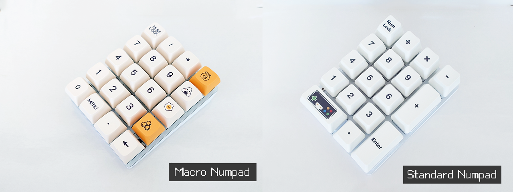

# 4x5 Macro-Numpad

In this folder, you will find the design files for the 4x5 macro-numpad. This macro-numpad can be arranged in both standard numpad or macro-numpad arrangement, depending on how your populate the PCB. 



The code can be found under the firmware folder. You can edit the code with Arduino IDE.

### Build Instruction

1. Send the PCB to print (See ./pcb)

2. Purchase all the required materials (See BOM list below)

3. 3D print the base plate (See ./models)

4. Install the required Arduino library for CH552G and drivers

5. Modify the sketch in 4x5macro-numpad (for 20 keys layout) or 4x5numpad (for 17 keys layout) 

6. Flash the CH552G with the sketch

#### Programming Tips
In the project folder, you can modify key events by changing the actions.ino file. Each keypress events corrisponding to one key-down and one key-up events. The label of each key-press events have a comment that matches the silk-screen label on the PCB. You can match them accordingly to know which switch you are modifying.

For example, for the switch case
```
// Case: row 2, col 0
```
corrisponding to the ```[2,0]``` switch on the PCB silk screen.

### Program Flashing Instructions

1. Hold and press the PROG button on the PCB

2. While the button has been held, insert the USB cable into the mini USB port

3. Release the button when the Arduino code has finished compiling and ready to upload (Timing is important)

4. Wait for the upload to complete

### Bill of materials

- 0805 LED x 2 (2 different color of your choice)

- 0805 0.1uF x 2

- 0805 10kΩ x 7

- Micro-USB port x 1

- SOP-16 CH552G x 1

- Cherry MX switches x 17 (or 20 if you are using macro-numpad layout)


See USBHIDMediaKeyboard.h for more details.
