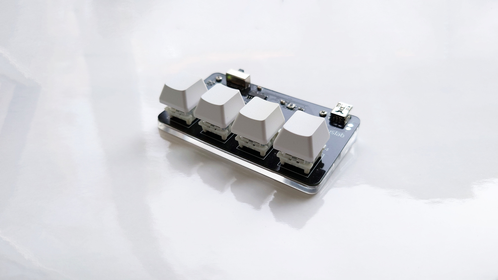
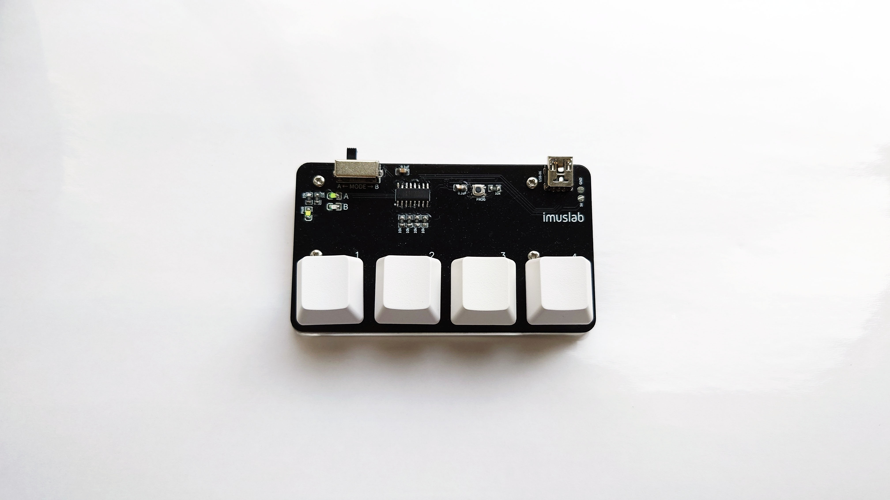
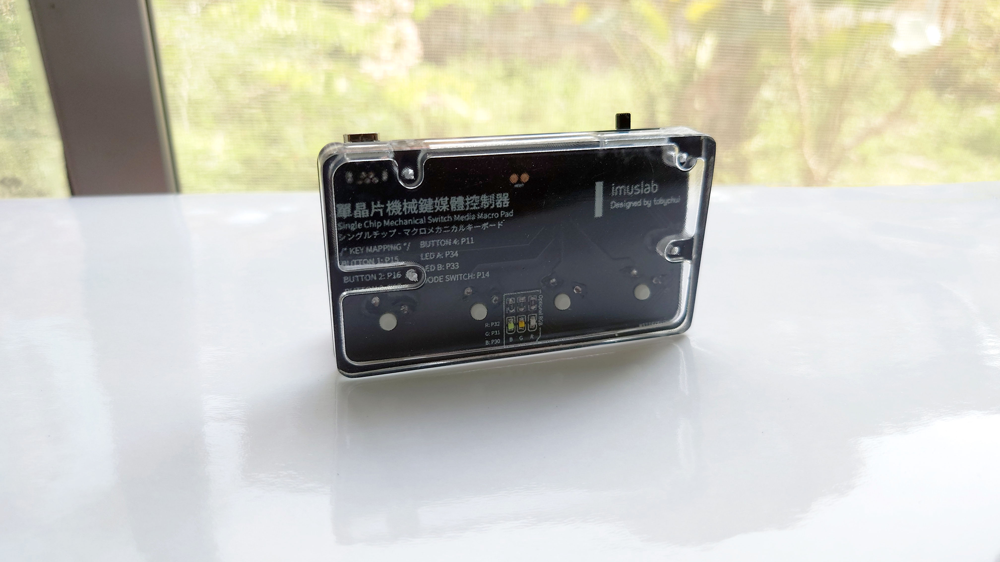
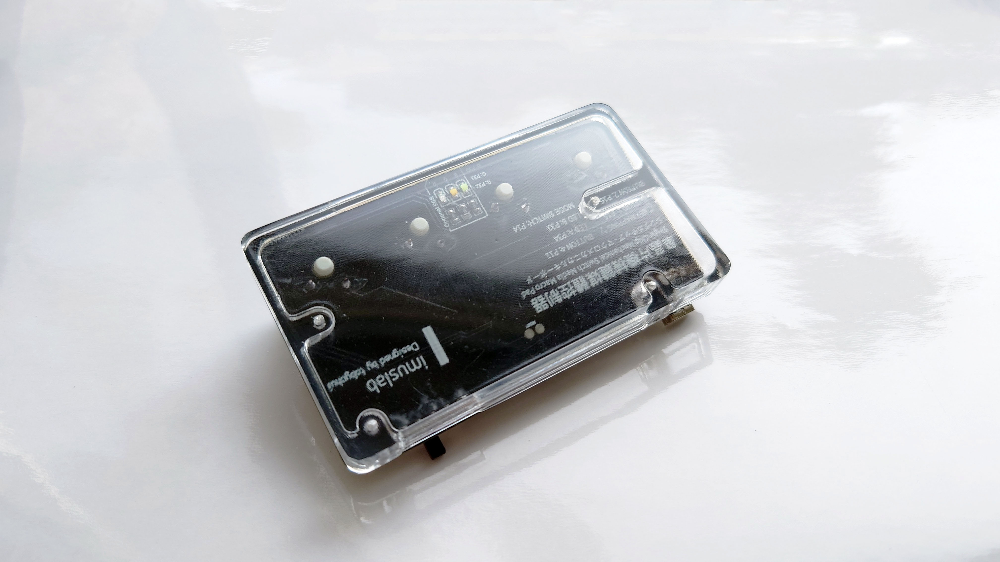

# 


# 4xMacropad

An ultra low cost, 4 keys mechanical macropad using CH552G.

### Build Instruction

1. Send the PCB to print (See ./pcb)

2. Purchase all the required materials (See BOM list below)

3. 3D print the base plate (See ./models)

4. Install the required Arduino library for CH552G and drivers

5. Visit [4-key Macropad | imuslab](https://tobychui.github.io/4xMacropad/) or modify the sketch in macrokey_distribute 

6. Flash the CH552G with the sketch


### Program Flashing Instructions

1. Hold and press the PROG button on the PCB

2. While the button has been held, insert the USB cable into the mini USB port

3. Release the button when the Arduino code has finished compiling and ready to upload (Timing is important)

4. Wait for the upload to complete


### Bill of materials

- 0805 LED x 3 (3 different color of your choice)

- 0805 0.1uF x 2

- 0805 10kΩ x 7

- 3 x 3 x 1.5mm micro switch x 1

- 5PF mini USB port  x 1

- SOP-16 CH552G  x 1

- SK12F14 switch x 1


Optional RGB signal lights on the back of the PCB, if you are going with transparent 3D printed case like mine

- 0805 LED x 3

- 0805 10kΩ x 3

### Photos










#### Advance Use-cases

If you want to generate automatic UTF-8 or big5 input to Windows program via this keyboard, it is also possible. See "zh-hk conv tool" folder for more details.

If you want to make this work with 3rd part key capture software like AutoHotkey, you can use F13 - F24 to send programmable key commands to your PC.  This can be done using the Web Programming interface or the following pre-defined constant (with Keyboard_write) for advance key-bindings

```arduino
#define KEY_F13       0xF0
#define KEY_F14       0xF1
#define KEY_F15       0xF2
#define KEY_F16       0xF3
#define KEY_F17       0xF4
#define KEY_F18       0xF5
#define KEY_F19       0xF6
#define KEY_F20       0xF7
#define KEY_F21       0xF8
#define KEY_F22       0xF9
#define KEY_F23       0xFA
#define KEY_F24       0xFB
```

See USBHIDMediaKeyboard.h for more details.

### License

Software: MIT License

Hardware: CC BY-NC-SA
