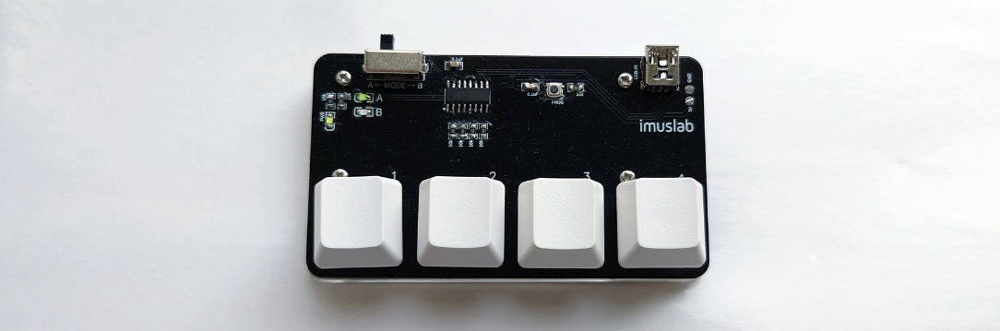
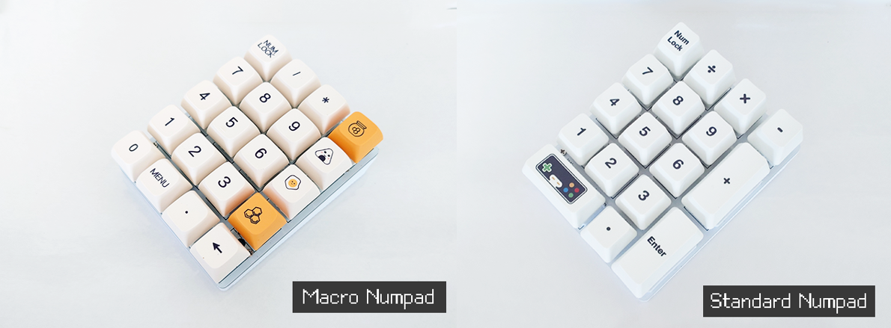

## CH552G DIY Mechanical Keyboard Archives

## 4xMacropad



An ultra low cost, 4 keys mechanical macropad using CH552G. See the ```/4xMacropad/ ```folder.

## 4x5 Macro-numpad



Another ultra low cost macropad + numpad powered by CH552G with two layouts on the same PCB. See the ```/4x5Macro-Numpad/``` folder.

### Build Instruction

1. Send the PCB to print (See /PCB)

2. Purchase all the required materials (See BOM list)

3. 3D print the base plate (See /3D Model)

4. Install the required Arduino library for CH552G and drivers

5. Visit [4-key Macropad | imuslab](https://tobychui.github.io/4xMacropad/) (4xMacropad only) or modify the sketch in /firmware folder

6. Flash the CH552G with the sketch

### Program Flashing Instructions

As all the keyboard designs share the same MCU and programming button design, this instruction should be suitable for all the macropads / numpad in this repo.

1. Hold and press the PROG button on the PCB

2. While the button has been held, insert the USB cable into the mini USB port

3. Release the button when the Arduino code has finished compiling and ready to upload (Timing is important)

4. Wait for the upload to complete

### License

Software: MIT License

Hardware: CC BY-NC-SA

**For those who don't want to read the CC license, NC means non-commercial only and SA means if you modified this work, you must also open source it with similar licensing requirements.**
